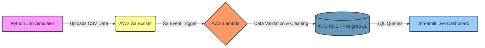

# 🧬 Real-Time Bioreactor Monitoring Pipeline

## 📖 Overview
This project is an **Event-Driven Serverless ETL Pipeline** designed to ingest, clean, and visualize IoT sensor data from biotech laboratory instruments (bioreactors). It simulates real-time batch data generation, securely processes it through AWS cloud infrastructure, and displays actionable insights on a live Streamlit dashboard.

The goal of this architecture is to ensure data integrity by filtering out anomalous equipment readings before they reach the data warehouse, providing scientists with reliable, real-time metrics.

---

## 🏗️ Architecture & Data Flow

This diagram illustrates the automated, serverless data pipeline:



---

## ⚙️ How It Works

**Data Generation:** A Python simulator generates mock sensor readings (pH, Temperature, Dissolved Oxygen) and injects intentional anomalies to simulate equipment failure.

**Event-Driven Ingestion:** The CSV is uploaded to AWS S3, automatically triggering an AWS Lambda function.

**In-Flight Data Sanitization:** The Lambda function reads the CSV in memory using native Python modules (no heavy Pandas layer needed), validates the data, and skips impossible readings (e.g., Temp > 500°C).

**Fault-Tolerant Storage:** Clean data is pushed to an AWS RDS PostgreSQL database. The database insertion uses row-by-row transaction handling (commit/rollback) to ensure one bad row doesn't fail the entire batch.

**Real-Time Visualization:** A Streamlit dashboard queries the RDS instance to display live batch trends, health metrics, and anomaly alerts.

---

## 🛠️ Tech Stack

- **Language:** Python 3.x
- **Cloud Infrastructure (AWS):** S3, Lambda, RDS (PostgreSQL), IAM, VPC Security Groups
- **Libraries:** boto3 (AWS SDK), psycopg2-binary (Database Driver), streamlit (UI), plotly (Data Viz), python-dotenv (Security)

---

## 🔒 Security Best Practices Implemented

- **Zero-Trust Networking:** The RDS database sits behind a strictly configured VPC Security Group, only allowing inbound traffic from specific IP and Lambda's internal Security Group.
- **Credential Management:** All database passwords and AWS keys are managed via .env files locally and Environment Variables in AWS Lambda.

Least Privilege: The AWS Lambda execution role only has the exact permissions needed to read from the specific S3 bucket and write to CloudWatch logs.

🚀 Local Setup & Installation

### Prerequisites
- Python 3.8+
- AWS Account with S3, Lambda, RDS, and IAM access
- PostgreSQL knowledge (basic)
- Git

### 1. Clone the Repository
```bash
git clone https://github.com/yourusername/BioData_Project.git
cd BioData_Project
```

### 2. Create Virtual Environment
```bash
python -m venv venv
source venv/bin/activate  # On Windows: venv\Scripts\activate
```

### 3. Install Dependencies
```bash
pip install -r requirements.txt
```

### 4. Configure Environment Variables
Create a `.env` file in the root directory (use `.env.example` as a template):
```bash
cp .env.example .env
```

Edit `.env` and add your RDS credentials:
```
DB_HOST=your-rds-endpoint.amazonaws.com
DB_NAME=postgres
DB_USER=postgres
DB_PASS=your_secure_password
```

### 5. Create & Initialize RDS Database
Before running the pipeline, create the required tables:

```bash
# Using psql command line:
psql -h your-rds-endpoint.amazonaws.com -U postgres -d postgres -f database_schema.sql

# Or copy-paste the SQL from database_schema.sql into DBeaver's query editor
```

This creates:
- `lab_readings` - Main sensor data table
- `lambda_audit_logs` - Audit trail of all processing events
- Views for dashboard queries: `batch_summary`, `pipeline_health`

### 6. Run the Data Simulator
DB_HOST=your-rds-endpoint.amazonaws.com
DB_NAME=postgres
DB_USER=postgres
DB_PASS=your_secure_password
```

**⚠️ IMPORTANT:** Never commit `.env` to version control. It's already in `.gitignore`.

### 5. Run the Data Simulator
First, generate and upload mock sensor data to S3:
```bash
python lab_instrument_simulator.py
```

### 5. Launch the Dashboards
**Main bioreactor monitoring dashboard:**
```bash
streamlit run bioreactor_dashboard.py
```

**Pipeline audit & health dashboard:**
```bash
streamlit run audit_dashboard.py
```

Both dashboards will open at `http://localhost:8501` (use different ports if running simultaneously)

---

## 📋 Audit & Compliance

### Lambda Audit Logging
Every S3 file processed by Lambda creates an immutable audit log entry with:
- **log_id** - Unique identifier for tracking
- **processed_at** - Exact timestamp of processing
- **file_name** - Source CSV file
- **total_rows** - Records received
- **rows_inserted** - Successfully validated & stored
- **rows_skipped** - Records that failed validation
- **errors_flagged** - Count of validation errors
- **processing_status** - SUCCESS / PARTIAL / FAILED
- **error_message** - Details if processing failed
- **processing_duration_seconds** - Performance metric

### Dashboard Monitoring
- **Bioreactor Dashboard** (`bioreactor_dashboard.py`) - Real-time sensor metrics & batch health
- **Audit Dashboard** (`audit_dashboard.py`) - Pipeline processing history, success rates, error logs

---

## 🏗️ AWS Deployment & Configuration

### AWS Infrastructure Required
1. **S3 Bucket** - For raw CSV data ingestion (`lab-data-intake-2026`)
2. **Lambda Function** - Triggered by S3 events to process and validate data
3. **RDS PostgreSQL** - Stores cleaned data
4. **Security Groups** - Control network access to RDS
5. **IAM Role** - Least privilege permissions for Lambda

### Setting Up AWS Resources

#### A. Create RDS PostgreSQL Instance
1. Go to AWS RDS Console
2. Create a PostgreSQL database (Standard Create recommended)
3. Configure VPC and Security Group
4. Note the endpoint for `.env` file

#### B. Create S3 Bucket
1. Create a bucket named `lab-data-intake-2026`
2. Enable versioning (optional, for data lineage)

#### C. Create Lambda Function
1. Create a new Python 3.11 runtime function
2. Set environment variables:
   - `DB_HOST`, `DB_NAME`, `DB_USER`, `DB_PASS`
   - Match those in `.env`
3. Attach the following managed policies:
   - `AmazonS3ReadOnlyAccess` (for reading from bucket)
   - `CloudWatchLogsFullAccess` (for logging)
4. Create inline policy for RDS access

#### D. Configure S3 Event Trigger
1. In Lambda, add trigger: S3 → `lab-data-intake-2026`
2. Event type: `PUT`
3. Prefix: `raw_data/`

#### E. Set Up RDS Security Group
Allow inbound traffic on port 5432 from:
- Your local IP (for development)
- Lambda Security Group (for AWS processing)
- DBeaver/Dashboard IP (for visualization)

### Monitoring & Logging
- CloudWatch: Lambda execution logs
- RDS: Enhanced monitoring for database health
- Streamlit: Check terminal output for dashboard errors

---

## 📚 Project Structure

```
BioData_Project/
├── bioreactor_dashboard.py      # Streamlit dashboard for real-time monitoring
├── lab_instrument_simulator.py  # Generates mock sensor data & uploads to S3
├── requirements.txt             # Python dependencies
├── .env.example                 # Template for environment variables
├── .gitignore                   # Files to exclude from version control
└── README.md                    # This file
```

---

## � Challenges Overcome

### PostgreSQL Transaction Management
Initially, a single anomalous row (e.g., mismatched data types) would abort the entire database transaction, causing data loss for the whole CSV. **Solution:** Decoupled transaction logic by implementing row-by-row `commit()` and `rollback()` handling inside the Lambda function to ensure continuous data flow even when individual rows fail.

### VPC & Network Security
**Challenge:** Allowing secure remote access to RDS (via DBeaver and Streamlit) without exposing the database to the public internet.
**Solution:** Configured AWS Security Groups with:
- Restricted CIDR blocks for personal IP
- Separate security group rules for Lambda execution role
- SSL/TLS encryption for all database connections

### Environment Variable Management Across AWS & Local
**Challenge:** Credentials needed to work seamlessly in both local `.env` and AWS Lambda environment variables.
**Solution:** Used `python-dotenv` with explicit path handling and `override=True` flag to load variables consistently across all environments.

---

## �🤝 Contributing

This project is open for contributions! If you'd like to improve it:

1. Fork the repository
2. Create a feature branch (`git checkout -b feature/amazing-feature`)
3. Commit changes (`git commit -m 'Add amazing feature'`)
4. Push to branch (`git push origin feature/amazing-feature`)
5. Open a Pull Request

### Areas for Enhancement
- Add unit tests for data validation logic
- Implement data export to CSV from dashboard
- Add email alerts for critical anomalies
- Support for multiple bioreactor units
- Grafana integration for advanced analytics

---

## 📄 License

This project is licensed under the MIT License - see the LICENSE file for details.

---

## 👨‍💻 Author

**Built by:** Your Name  
**LinkedIn:** [Your LinkedIn Profile]  
**GitHub:** [Your GitHub Profile]

Feel free to reach out with questions or suggestions!

---

## ⭐ Acknowledgments

- AWS documentation for serverless architecture best practices
- Streamlit community for excellent dashboard framework
- PostgreSQL for robust data management

