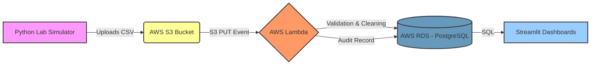

# 🧬 Real-Time Bioreactor Monitoring Pipeline

An event-driven serverless pipeline for bioreactor sensor telemetry, built around **GxP data-integrity requirements** rather than throughput.

Every file processed writes an append-only audit-log record — timestamp, rows received, rows inserted, rows rejected, processing status, duration — so the fate of every record is reconstructable after the fact. Ingestion uses row-by-row transaction handling so a single malformed reading fails in isolation instead of aborting the batch and silently discarding good data.

The design target is **ALCOA+** — attributable, legible, contemporaneous, original, accurate — the standard an FDA inspector applies to electronic records under 21 CFR Part 11. In a regulated lab, a pipeline that drops data quietly is worse than one that fails loudly; every decision below follows from that.

**Stack:** Python · AWS (S3 → Lambda → RDS PostgreSQL) · Streamlit · Plotly

---

## 📋 Audit Trail & Compliance Design

### Append-only processing log

Every S3 object processed by Lambda writes one record to `lambda_audit_logs`:

| Field | Purpose |
|---|---|
| `log_id` | Unique identifier for the processing event |
| `processed_at` | Timestamp of processing (contemporaneous record) |
| `file_name` | Source CSV — links stored rows back to their origin |
| `total_rows` | Records received |
| `rows_inserted` | Records validated and stored |
| `rows_skipped` | Records rejected at validation |
| `errors_flagged` | Count of validation errors |
| `processing_status` | `SUCCESS` / `PARTIAL` / `FAILED` |
| `error_message` | Failure detail, where applicable |
| `processing_duration_seconds` | Performance metric |

The purpose is reconstruction. Given any row in `lab_readings`, you can identify the source file, when it was processed, and how many of its sibling records were rejected and why. Given any source file, you can account for every row it contained. **No record disappears without a corresponding entry explaining its absence** — that accounting is the entire point.

### Validation rules

Readings are rejected at ingestion when they fall outside physically possible ranges (e.g. temperature > 500 °C), indicating sensor or equipment fault rather than a real process excursion. Rejected rows are **counted and logged, not silently dropped** — the distinction matters, because a rejected reading is itself evidence that an instrument needs attention.

### Dashboards

- **`bioreactor_dashboard.py`** — live batch trends, sensor metrics, anomaly alerts
- **`audit_dashboard.py`** — pipeline processing history, success rates, error logs

The audit dashboard exists because in a regulated environment, *"was the data captured correctly?"* is a separate question from *"what does the data say?"*, and it needs its own answer.

---

## 🏗️ Architecture


```mermaid
graph LR
    A[Python Lab Simulator] -->|Uploads CSV| B(AWS S3 Bucket)
    B -->|S3 PUT Event| C{AWS Lambda}
    C -->|Validation & Cleaning| D[(AWS RDS - PostgreSQL)]
    C -->|Audit Record| D
    D -->|SQL| E[Streamlit Dashboards]

    style A fill:#f9f,stroke:#333,stroke-width:2px
    style B fill:#ff9,stroke:#333,stroke-width:2px
    style C fill:#f96,stroke:#333,stroke-width:2px
    style D fill:#69b,stroke:#333,stroke-width:2px
    style E fill:#9cf,stroke:#333,stroke-width:2px
```

**Data generation** — a Python simulator produces mock sensor readings (pH, temperature, dissolved oxygen) with intentional anomalies injected to simulate equipment failure.

**Event-driven ingestion** — CSV upload to S3 triggers Lambda via a PUT event on the `raw_data/` prefix. No polling, no scheduler.

**In-flight sanitization** — Lambda reads the CSV in memory using native Python modules (no Pandas layer required), validates each row, and rejects impossible readings.

**Fault-tolerant storage** — clean rows are written to RDS PostgreSQL with per-row commit/rollback handling. One bad row cannot take down the batch.

**Visualization** — Streamlit dashboards query RDS directly for live trends and audit history.

---

## 🔍 Data-Integrity Design Decisions

### Row-level transaction isolation

**Problem:** a single anomalous row — a type mismatch, a malformed field — aborted the entire PostgreSQL transaction, discarding every valid row in the same CSV. From a data-integrity standpoint this is the worst possible failure mode: silent, total, and invisible downstream. An inspector asking *"where did batch 47 go?"* would have no answer.

**Solution:** decoupled the transaction boundary from the batch. Each row commits or rolls back independently inside the Lambda handler, and every rejection increments a counter that lands in the audit log. Good data survives; bad data is accounted for.

This is the pattern that makes the pipeline defensible rather than merely functional, and it is the single most important decision in the project.

### Network isolation

**Problem:** the RDS instance needed to be reachable from a local dev machine (DBeaver) and the Streamlit dashboards, without exposing a database holding lab records to the public internet.

**Solution:** RDS sits in a VPC behind a security group permitting inbound 5432 only from a restricted CIDR block (developer IP) and the Lambda execution role's security group. All database connections use SSL/TLS. No public accessibility.

### Environment parity

**Problem:** credentials had to resolve identically in local development (`.env`) and in Lambda (environment variables), without branching logic that could drift between the two.

**Solution:** `python-dotenv` with explicit path handling and `override=True`, so the same code path loads configuration in both environments.

---

## 🛠️ Tech Stack

- **Language:** Python 3.11
- **AWS:** S3, Lambda, RDS (PostgreSQL), IAM, VPC Security Groups, CloudWatch
- **Libraries:** `boto3`, `psycopg2-binary`, `streamlit`, `plotly`, `python-dotenv`

---

## 🔒 Security

- **Network:** RDS is not publicly accessible. Inbound 5432 is restricted to a specific developer CIDR and the Lambda security group. SSL/TLS enforced on all connections.
- **Credentials:** no secrets in source. Local config via `.env` (gitignored); Lambda config via environment variables.
- **IAM:** the Lambda execution role is granted S3 read access to the ingestion bucket and CloudWatch Logs write access, plus an inline policy for RDS connectivity. See *Scope & Limitations* for how this would need to tighten in a production GxP deployment.

---

## 🚀 Setup

### Prerequisites

- Python 3.8+
- AWS account with S3, Lambda, RDS, and IAM access
- Basic PostgreSQL familiarity
- Git

### 1. Clone

```bash
git clone https://github.com/Backerma15/bioreactor-monitoring-pipeline.git
cd bioreactor-monitoring-pipeline
```

### 2. Virtual environment

```bash
python -m venv venv
source venv/bin/activate        # Windows: venv\Scripts\activate
```

### 3. Dependencies

```bash
pip install -r requirements.txt
```

### 4. Configure environment

```bash
cp .env.example .env
```

Edit `.env`:

```
DB_HOST=your-rds-endpoint.amazonaws.com
DB_NAME=postgres
DB_USER=postgres
DB_PASS=your_secure_password
```

> ⚠️ Never commit `.env`. It is already in `.gitignore`.

### 5. Initialize the database

```bash
psql -h your-rds-endpoint.amazonaws.com -U postgres -d postgres -f database_schema.sql
```

Creates:

- `lab_readings` — sensor data
- `lambda_audit_logs` — processing audit trail
- Views: `batch_summary`, `pipeline_health`

### 6. Generate and upload sample data

```bash
python lab_instrument_simulator.py
```

### 7. Launch dashboards

```bash
streamlit run bioreactor_dashboard.py          # monitoring
streamlit run audit_dashboard.py --server.port 8502   # audit trail
```

---

## ☁️ AWS Configuration

### RDS (PostgreSQL)

Create a PostgreSQL instance. Disable public accessibility. Note the endpoint for `.env`.

### S3

Create the ingestion bucket (`lab-data-intake-2026`). Versioning optional, useful for data lineage.

### Lambda

1. Python 3.11 runtime.
2. Environment variables: `DB_HOST`, `DB_NAME`, `DB_USER`, `DB_PASS`.
3. Execution role: S3 read on the ingestion bucket, CloudWatch Logs write, inline policy for RDS access.
4. Place in the same VPC as RDS.

### S3 event trigger

Lambda trigger → S3 → `lab-data-intake-2026`, event type `PUT`, prefix `raw_data/`.

### RDS security group

Inbound 5432 from:

- developer IP (CIDR-restricted)
- Lambda security group

### Monitoring

CloudWatch for Lambda execution logs; RDS Enhanced Monitoring for database health.

---

## 📁 Project Structure

```
bioreactor-monitoring-pipeline/
├── lambda_function.py             # S3-triggered handler: validation, row-level commit, audit logging
├── lab_instrument_simulator.py    # Generates mock sensor data with injected faults, uploads to S3
├── bioreactor_dashboard.py        # Streamlit: live monitoring
├── audit_dashboard.py             # Streamlit: pipeline audit trail & health
├── database_schema.sql            # Tables (lab_readings, lambda_audit_logs) and views
├── requirements.txt
├── .env.example
├── .gitignore
└── README.md
```

---

## ⚖️ Scope & Limitations

This is a **demonstration pipeline built to GxP data-integrity principles — it is not a validated system.** Stating the gap explicitly, because in a regulated environment the gap is the whole conversation:

- **No validation lifecycle executed.** No URS, functional or design specification, IQ/OQ/PQ protocols, traceability matrix, or validation summary report. The architecture is designed to be validatable; it has not been validated.
- **Audit log is append-only by convention, not enforced.** `lambda_audit_logs` is a standard PostgreSQL table — nothing at the database level prevents `UPDATE` or `DELETE`. True immutability would require revoking those grants from the application role, or writing to WORM storage (e.g. S3 Object Lock). This is the most significant gap between this project and a Part 11–compliant audit trail.
- **No electronic signatures.** 21 CFR Part 11 Subpart C is out of scope entirely.
- **Credentials via environment variables**, not AWS Secrets Manager with rotation. Acceptable for a demonstration; not for a GxP production system.
- **IAM is scoped but not minimal.** Managed policies are used where an inline, resource-scoped policy would be correct for production.
- **Simulated data.** Readings come from a generator, not real instrument output. Fault injection is synthetic and does not model real sensor drift.
- **No automated tests** on the validation logic — the obvious next addition, and a prerequisite for any OQ.

### Next steps

- Unit tests for validation logic (prerequisite for OQ protocol authoring)
- Database-level append-only enforcement on the audit table
- Secrets Manager with rotation
- Draft URS + traceability matrix against the existing implementation

---

## 📄 License

MIT — see `LICENSE`.

---

## 👤 Author

**Brandon Ackermann** — software engineer with a decade in FDA/USDA-regulated environments, eight of them as a federal inspector. This project comes out of watching lab and production data systems fail in ways that were entirely preventable.

[LinkedIn](https://www.linkedin.com/in/brandon-ackermann-115aba3b3) · [GitHub](https://github.com/Backerma15)